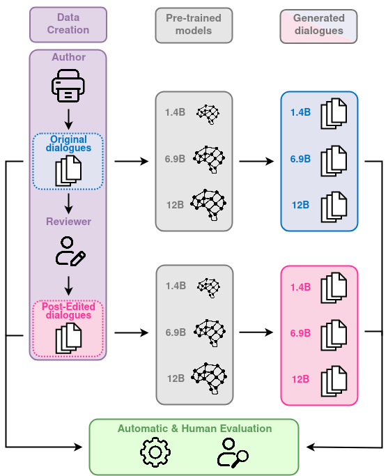

# HED-IT (Human Edited Dialogues for ITalian)

Welcome to the `HED-IT` repository! 

<p align="center">
  
</p>


`HED-IT` is a large-scale Italian dataset where machine-generated dialogues between two speakers are paired with the version post-edited by humans. 
In this repository we release the post-edited data only.

## Dataset Overview

The `HED-IT` dataset utilizes a dual-component author-reviewer pipeline:
1. `author`: an automatic module generating initial data without the need for model-specific fine-tuning.
2. `reviewer`: a module in which human reviewers post-edit this generated content to ensure data quality.

For the author module, we implemented three distinct strategies to generate the following dialogue categories:
- **Human Dialogues** (Dial-H): We sourced human-written dialogues from movie scripts collected across various genres, using an algorithm in the author module to extract specific portions based on given characteristics.
- **Human-LLM Dialogues** (Dial-HLLM): We prompted ChatGPT to rewrite selected portions of movie dialogues to enhance their clarity.
- **LLM Dialogues** (Dial-LLM): We generated synthetic dialogues by instructing ChatGPT with diverse prompts using various human-written contexts

For a deeper understanding of the author-reviewer pipeline, please refer to our paper.

The dataset comprises synthetic data and non-real data derived from movie scripts, selected to mitigate potential privacy and data ephemerality issues.

<p align="center">
  
</p>

## Dataset Statistics

The following table reports the post-edited dataset's main statistics in terms of counts.

| Description | Dial-H | DialH-LLM | Dial-LLM | Total |
|-------------|--------|-----------|----------|-------|
| Dials (edited) | 1,107  | 2,824     | 3,266    | 7,197 |
| Turns (edited) | 7,817  | 16,422    | 23,704   | 47,943 |
| Turns/Dial (edited) | 8      | 7         | 10       | 8 |
| Tokens/Dial (edited) | 173    | 140       | 332      | 232 |
| Tokens/Turn (edited) | 23     | 22        | 35       | 29 |

## File Description

In the folder `dataset/all_post_edited`, we provide the following files:
+ `all_post_edited_dialogues.json`: the list of the post-edited dialogues,
+ `partitions_ids.json`: the list of dialogue ids for train, valid and test partitions

## Citation 

Further details can be found in our paper:

Daniela Occhipinti, Michele Marchi, Irene Mondella, Huiyuan Lai, Felice Dell'Orletta, Malvina Nissim, Marco Guerini, 2024. *Fine-tuning with HED-IT: The impact of human post-editing for dialogical language models*. arXiv preprint arXiv:2406.07288

```bibtex
@misc{occhipinti2024finetuning,
      title={Fine-tuning with HED-IT: The impact of human post-editing for dialogical language models}, 
      author={Daniela Occhipinti and Michele Marchi and Irene Mondella and Huiyuan Lai and Felice Dell'Orletta and Malvina Nissim and Marco Guerini},
      year={2024},
      eprint={2406.07288},
      archivePrefix={arXiv},
      primaryClass={cs.CL}
}
```